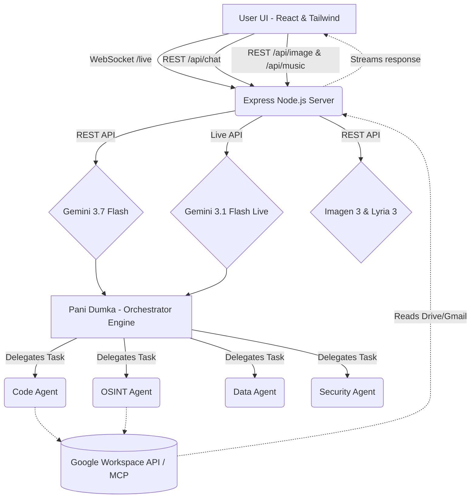

# 🇺🇦 Пані Думка (Pani Dumka) - The Fortified Enterprise Fleet

> **Track:** The Fortified Enterprise Fleet  
> **Hosted Application:** [Launch Pani Dumka (Cloud Run)](https://ais-pre-kms3lr5xqgvupwbrjinvig-575138144425.europe-west2.run.app)  
> **Models Used:** Gemini 3.7 Flash, Gemini 3.1 Flash Live Preview (Voice API), Imagen 3, Lyria 3 Pro.  
> **Frameworks:** `@google/genai` (GenAI SDK & Live Interactions API).  
> **Google Cloud Services:** Cloud Run (Deployment), Google Workspace APIs (Drive, Gmail, Docs via MCP).  

## 📖 Text Description & Value Proposition

**The Problem:** Standard LLM chat interfaces fall short for complex, multi-layered enterprise tasks. When a user asks to "analyze this data, find OSINT on the author, write a secure script, and email the results," a single LLM loop struggles with context degradation and lack of specialization. 

**The Solution:** Meet **Пані Думка (Pani Dumka)**, a powerful generative AI orchestrator built for the modern enterprise. She acts as the "CEO" of an elite ecosystem of **20 specialized AI agents** (including Security, Code, OSINT, Data, Finance, and QA agents). 

**Key Features:**
- **Dynamic Multi-Agent Orchestration:** Pani Dumka analyzes incoming tasks and routes them autonomously to the most capable agent in her fleet.
- **Interactions API (Live Voice):** Talk directly to Pani Dumka in real-time. She uses the cutting-edge `gemini-3.1-flash-live-preview` model for bidirectional, low-latency audio conversations.
- **Model Context Protocol (MCP) & Workspace Integration:** The agents can list Google Drive files, read Google Docs, and send/read Gmails natively via MCP bridges.
- **Multi-Modal Generation:** The app natively integrates **Imagen 3** (Image Studio) and **Lyria 3 Pro** (Music Studio) directly into the orchestrator's toolbelt, allowing the creation of visual and audio assets without leaving the workspace.

**What I Learned:** Building a multi-agent system highlighted the importance of a strong "System Prompt Architecture." By assigning very rigid, narrow scopes to sub-agents and a broad "judge/router" scope to Pani Dumka, hallucination rates dropped drastically. Implementing the Live API over WebSockets (with ElevenLabs for high-quality TTS) was challenging but incredibly rewarding for reducing latency.

## 🏗️ Architecture Diagram



## 🛠️ Spin-up Instructions

Follow these steps to run the "Fortified Enterprise Fleet" locally:

### 1. Prerequisites
- **Node.js** (v18 or higher recommended)
- **Google Cloud Platform (GCP)** account with Vertex AI & Gemini APIs enabled.
- A valid **Gemini API Key** (`GEMINI_API_KEY`).
- *(Optional)* An **ElevenLabs API Key** (`ELEVENLABS_API_KEY`) for enhanced Voice TTS.

### 2. Environment Variables
Create a `.env` file in the root of the project with the following keys:
```env
# Required
GEMINI_API_KEY=your_google_ai_studio_or_vertex_key

# Optional (For Live API TTS)
ELEVENLABS_API_KEY=your_elevenlabs_key
ELEVENLABS_VOICE_ID=XsDwVNgam5laFw4WF7S6
```

### 3. Installation & Run
```bash
# Install dependencies
npm install

# Build the client & server for production
npm run build

# Start the full-stack server (runs on port 3000)
npm run start
```
*The application will be available at `http://localhost:3000`.*

### 4. Deploying to Google Cloud Run
This project is container-ready. 
1. Authenticate with Google Cloud: `gcloud auth login`
2. Set your project: `gcloud config set project [PROJECT_ID]`
3. Deploy directly from source:
```bash
gcloud run deploy pani-dumka \
  --source . \
  --platform managed \
  --region us-central1 \
  --allow-unauthenticated \
  --set-env-vars GEMINI_API_KEY=your_key
```

## 🎥 Demo Video Overview
Our 4-minute demo covers:
1. **The Problem:** The inefficiency of using single-threaded chat models for complex engineering/OSINT tasks.
2. **The Solution:** Introducing Pani Dumka. We show the UI and the 20-agent ecosystem.
3. **Live Demo:** 
   - We speak to Pani Dumka via the real-time Voice UI (powered by Gemini 3.1 Live).
   - We ask her to investigate a topic. She delegates it to the OSINT agent, synthesizes the results, and uses the Workspace MCP to draft the findings into a new Google Doc.
   - Finally, we generate a high-quality visualization using Imagen 3 directly in the studio.
4. **Cloud Infrastructure:** A quick look at the Cloud Run dashboard where the system is securely hosted.

---
*Built for the Google All Things Agentic Hackathon. 🇺🇦*
